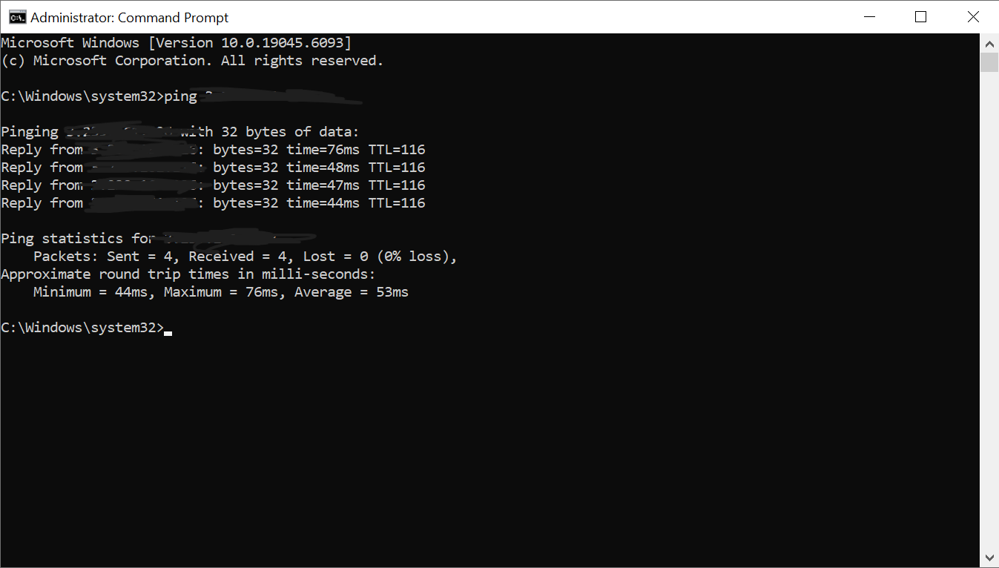

# AWS VPC Basic Infrastructure Project

![Architecture Overview]documentation/architecture/Architecture1.PNG

## 🎯 Project Overview

A hands-on cloud infrastructure project demonstrating fundamental AWS networking concepts by building a complete VPC environment from scratch. This project showcases the ability to design, implement, and validate secure cloud network architecture.

## 🏗️ Architecture Components

### Network Infrastructure
- **VPC**: Isolated cloud network (10.0.0.0/16 CIDR)
- **Internet Gateway**: Provides internet access to public resources
- **Public Subnet**: Internet-accessible subnet (10.0.1.0/24)
- **Route Table**: Directs traffic between subnet and internet gateway

### Compute & Security
- **EC2 Instance**: Amazon Linux 2023 on t2.micro (free tier)
- **Security Group**: Configured with least-privilege access principles
- **Key Pair**: Secure SSH access management

## 🔧 Implementation Steps

1. **VPC Creation**: Established isolated network environment with proper CIDR planning
2. **Subnet Design**: Created public subnet with appropriate address space allocation  
3. **Gateway Configuration**: Attached and configured Internet Gateway for external connectivity
4. **Routing Setup**: Configured route tables to direct traffic appropriately
5. **Security Implementation**: Created security groups following best practices
6. **Compute Deployment**: Launched and configured EC2 instance
7. **Connectivity Validation**: Tested end-to-end network connectivity

## 🛡️ Security Features

- **Principle of Least Privilege**: Security groups allow only necessary traffic
- **Network Segmentation**: Proper subnet isolation and CIDR planning
- **Secure Access**: SSH access restricted to specific IP addresses
- **Protocol-Specific Rules**: Granular control over different traffic types

## 📊 Key Learning Outcomes

### Technical Skills Demonstrated
- **Cloud Networking**: Understanding of VPC, subnets, and routing concepts
- **Security Implementation**: Applied security best practices in cloud environment
- **Infrastructure Validation**: Systematic testing and verification of network connectivity
- **Documentation**: Professional documentation of technical implementation

### AWS Services Utilized
- Amazon VPC
- Amazon EC2
- Internet Gateway
- Security Groups
- Route Tables

## 🧪 Testing & Validation

Successfully validated the infrastructure through:
- **Connectivity Testing**: Confirmed internet access via ICMP ping
- **Security Verification**: Validated security group rules function correctly
- **Route Validation**: Confirmed proper traffic routing through gateway

## 💡 Real-World Applications

This foundational architecture demonstrates skills applicable to:
- **Enterprise Network Design**: Scalable VPC architectures for business applications
- **Security Implementation**: Network-level security controls for cloud workloads
- **Infrastructure Planning**: Proper capacity planning and resource allocation
- **DevOps Foundations**: Infrastructure knowledge essential for automation

## 🚀 Future Enhancements

Potential expansions of this project:
- [ ] Multi-AZ deployment for high availability
- [ ] Private subnet implementation with NAT Gateway
- [ ] Load balancer integration for scalability
- [ ] Infrastructure as Code with Terraform
- [ ] Monitoring and logging with CloudWatch
- [ ] Database integration with RDS

## 💰 Cost Optimization

- **Free Tier Compliance**: All resources selected within AWS free tier limits
- **Resource Cleanup**: Proper termination procedures to avoid unexpected charges
- **Monitoring**: Regular cost tracking and resource utilization review

## 📸 Project Documentation

Complete visual documentation of the build process:

| Component | Screenshot |
|-----------|------------|
| VPC Creation | [View](documentation/screenshots/VPC-Created.png) |
| Public Subnet Setup | [View](documentation/screenshots/Public-Subnet-Created.png) |
| Internet Gateway | [View](documentation/screenshots/IGW-Created.png) |
| Route Table Config | [View](documentation/screenshots/Route-Table-For-SN-Created.png) |
| Security Groups | [View](documentation/screenshots/SG-Created.png) |
| EC2 Instance | [View](documentation/screenshots/EC2-Created.png) |
| EC2 Details | [View](documentation/screenshots/EC2-Created-P2.png) |
| Connectivity Test | [View](documentation/screenshots/Ping-Test-From-Instance.png) |

## 🛠️ Technologies Used

## 📫 Connect With Me

- LinkedIn: [Your LinkedIn Profile]
- Email: [Your Email]

---

**⚡ This project demonstrates foundational cloud architecture skills and AWS networking expertise essential for modern infrastructure roles.**
